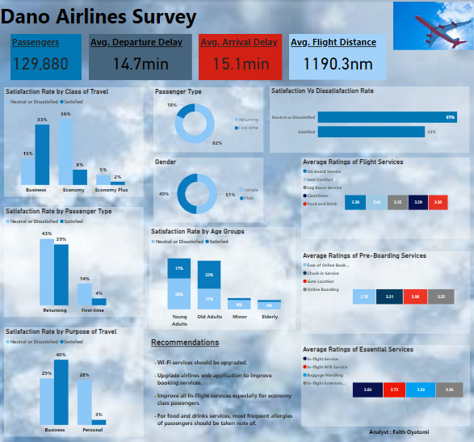

# Dano-Airlines-Survey

## Introduction
This project is an analysis for Dano Airlines, a Uk-based airline headquartered in London, United Kingdom. The latest passenger survey results just came in and it looks like the satisfaction rate dipped under 50% for the first time ever. I analyzed the date to spot notable reasons for decline and to find key areas to focus on for getting back on track. The survey was done with the use of ratings from 1-5. 

## Power BI Concepts applied:

- Data Modeling Star Schema (Many:*)
- Applied filters
- Created a conditional column for Age groups

## Problem Statement

- How does the satisfaction rate vary with age groups?
- Which percentage of airline passengers are satisfied according to class, purpose of travel and passenger type?
- What factors contribute to customer satisfaction the most as well as dissatisfaction?

## Data Source
This data was provided at the completion of a Data Analytics cohort as a CSV file.
It contains one sheet.

## Tools
Power Query (Data cleaning and Data transformation)
Power BI (Data Visualization)

## Data Visualization

## Insights

- We have more of young adults and old adults as passengers with 26% and 17% dissatisfaction rate respectively.
- Dissatisfied customers is high for economy class with 36.47% followed by business then economy plus class.
- Repeated customers are more than first-timers. The dissatisfaction rate of first is huge as compared to the satisfaction rate.
- In-flight services and baggage handling are the highest rated services. In-flight Wi-Fi services and online booking services are the lowest rated.

Recommendations can be seen on the dashboard.
